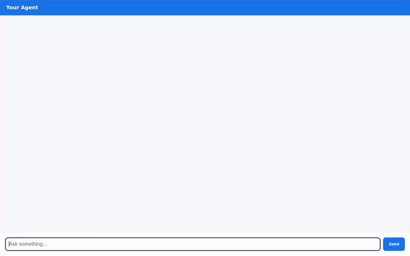

# 🌦️ Weather Agent (Build with Gemini)

A premium, agent-first weather assistant built on Google Cloud. It fetches real-time weather metrics, converts them to Celsius, and dynamically generates custom high-fidelity illustrations of the current conditions—presenting both a rich text description and a beautiful graphic right in the chat.

<div align="center">
  
</div>

---

## 🚀 Key Features

* **Real-time Weather Intelligence:** Seamless lookup of live temperature, humidity, and forecasts.
* **On-the-Fly Weather Illustration:** Automatically generates stunning, tailored weather graphics for any location using Vertex AI.
* **Streamlined Chat Interface:** Fully active web-based chat frontend featuring quick interactive turns.
* **Automatic Celsius Standard:** All weather information is carefully normalized to Celsius standard for international consistency.

---

## 🛠️ Google Cloud & Vertex AI Integration

This project is a showcase of native integrations utilizing the core **Google Cloud Agent Platform** ecosystem:

1. **🧠 Vertex AI Memory Bank:** Provides cross-session, long-term memory capabilities so the agent remembers your location preferences, past queries, and custom instructions between chat sessions.
2. **🗄️ Cloud Firestore:** Serves as the high-availability structured database for user sessions, conversational history, and persistent agent state.
3. **🖼️ Google Cloud Storage (GCS):** Automatically uploads and stores generated weather graphics to deliver lightning-fast, public `https` image URLs for browser rendering.
4. **📖 Vertex AI RAG Engine:** Grounded retrieval-augmented generation engine to search local weather guide documents and documentation.
5. **🎨 Image Generation:** Uses the advanced **`gemini-3.1-flash-lite-image`** model on Vertex AI (`global` region) to synthesize high-quality, creative meteorological illustrations.
6. **🪟 A2UI (Agent-to-User Interface):** Supports rich UI components (cards, layouts, and tables) directly generated by the agent and natively rendered in the frontend.

---

## 📂 Project Structure

```
weather-agent/
├── app/                      # Core agent code
│   ├── agent.py              # Main agent logic & tool registrations
│   ├── fast_api_app.py       # FastAPI Backend server
│   └── app_utils/            # Agent and storage utility helpers
├── frontend/                 # Chat web interface
│   ├── main.py               # FastAPI static server & proxy client
│   └── static/               # HTML/CSS/JS frontend UI assets
├── weather_agent_demo.gif    # Optimized, looping demo recording
├── pyproject.toml            # Project dependencies and configs
└── README.md                 # Project documentation
```

---

## ⚡ Quick Start

### 1. Install Dependencies
```bash
agents-cli install
```

### 2. Start the Agent Playground
To run the local ADK Web-based Playground:
```bash
agents-cli playground
```

### 3. Run the Custom Web Frontend
To run the beautiful web-based chat proxy interface:
```bash
cd frontend
python main.py
```
Open **[http://localhost:8080](http://localhost:8080)** in your browser and start chatting!
